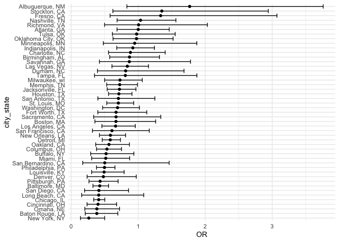

p8105_hw6_th3072
================

``` r
library(tidyverse)
```

    ## ── Attaching core tidyverse packages ──────────────────────── tidyverse 2.0.0 ──
    ## ✔ dplyr     1.1.3     ✔ readr     2.1.4
    ## ✔ forcats   1.0.0     ✔ stringr   1.5.0
    ## ✔ ggplot2   3.4.3     ✔ tibble    3.2.1
    ## ✔ lubridate 1.9.2     ✔ tidyr     1.3.0
    ## ✔ purrr     1.0.2     
    ## ── Conflicts ────────────────────────────────────────── tidyverse_conflicts() ──
    ## ✖ dplyr::filter() masks stats::filter()
    ## ✖ dplyr::lag()    masks stats::lag()
    ## ℹ Use the conflicted package (<http://conflicted.r-lib.org/>) to force all conflicts to become errors

``` r
library(modelr)
```

# Problem 1

``` r
homicides <- read.csv("./hw6_data/homicide-data.csv", na = c("", "NA", "Unknown"))

homicides <- homicides |>
  mutate(city_state = str_c(city, state, sep = ", "),
         resolution = case_when(
         disposition %in% c("Closed without arrest", "Open/No arrest") ~ 0,
         disposition == "Closed by arrest" ~ 1),
         victim_age = as.numeric(victim_age),
         )|>
  filter(!city_state %in% c("Dallas, TX", "Phoenix, AZ", "Kansas City, MO", "Tulsa, AL"))|> 
           filter(victim_race %in% c("White", "Black"))|>
  select(city_state, resolution, victim_age, victim_sex, victim_race)
```

``` r
baltimore_glm <- homicides |>
  filter(city_state == "Baltimore, MD") |>
  glm(formula = resolution ~ victim_age + victim_sex + victim_race, data = _, family = binomial())

baltimore_glm |> 
  broom::tidy() |> 
  mutate(
    OR = exp(estimate), 
    OR_CI_upper = exp(estimate + 1.96 * std.error),
    OR_CI_lower = exp(estimate - 1.96 * std.error)) |> 
  filter(term == "victim_sexMale") |> 
  select(OR, OR_CI_lower, OR_CI_upper) |>
  knitr::kable(digits = 3)
```

|    OR | OR_CI_lower | OR_CI_upper |
|------:|------------:|------------:|
| 0.426 |       0.325 |       0.558 |

``` r
model_results <- homicides |>
  group_by(city_state) |>
  nest() |>
  mutate(
    models = map(data, function(df) {
      glm(resolution ~ victim_age + victim_sex + victim_race, family = binomial(), data = df)
    }),
    tidy_models = map(models, broom::tidy)
  ) |>
  select(-models, -data) |>
  unnest(cols = tidy_models) |>
  mutate(
    OR = exp(estimate),
    OR_CI_upper = exp(estimate + 1.96 * std.error),
    OR_CI_lower = exp(estimate - 1.96 * std.error)
  ) |>
  filter(term == "victim_sexMale") |>
  select(city_state, OR, OR_CI_lower, OR_CI_upper) |>
  ungroup()

model_results |>
  knitr::kable(digits = 3)
```

| city_state         |    OR | OR_CI_lower | OR_CI_upper |
|:-------------------|------:|------------:|------------:|
| Albuquerque, NM    | 1.767 |       0.831 |       3.761 |
| Atlanta, GA        | 1.000 |       0.684 |       1.463 |
| Baltimore, MD      | 0.426 |       0.325 |       0.558 |
| Baton Rouge, LA    | 0.381 |       0.209 |       0.695 |
| Birmingham, AL     | 0.870 |       0.574 |       1.318 |
| Boston, MA         | 0.667 |       0.354 |       1.260 |
| Buffalo, NY        | 0.521 |       0.290 |       0.935 |
| Charlotte, NC      | 0.884 |       0.557 |       1.403 |
| Chicago, IL        | 0.410 |       0.336 |       0.501 |
| Cincinnati, OH     | 0.400 |       0.236 |       0.677 |
| Columbus, OH       | 0.532 |       0.378 |       0.750 |
| Denver, CO         | 0.479 |       0.236 |       0.971 |
| Detroit, MI        | 0.582 |       0.462 |       0.734 |
| Durham, NC         | 0.812 |       0.392 |       1.683 |
| Fort Worth, TX     | 0.669 |       0.397 |       1.127 |
| Fresno, CA         | 1.335 |       0.580 |       3.071 |
| Houston, TX        | 0.711 |       0.558 |       0.907 |
| Indianapolis, IN   | 0.919 |       0.679 |       1.242 |
| Jacksonville, FL   | 0.720 |       0.537 |       0.966 |
| Las Vegas, NV      | 0.837 |       0.608 |       1.154 |
| Long Beach, CA     | 0.410 |       0.156 |       1.082 |
| Los Angeles, CA    | 0.662 |       0.458 |       0.956 |
| Louisville, KY     | 0.491 |       0.305 |       0.790 |
| Memphis, TN        | 0.723 |       0.529 |       0.988 |
| Miami, FL          | 0.515 |       0.304 |       0.872 |
| Milwaukee, wI      | 0.727 |       0.499 |       1.060 |
| Minneapolis, MN    | 0.947 |       0.478 |       1.875 |
| Nashville, TN      | 1.034 |       0.685 |       1.562 |
| New Orleans, LA    | 0.585 |       0.422 |       0.811 |
| New York, NY       | 0.262 |       0.138 |       0.499 |
| Oakland, CA        | 0.563 |       0.365 |       0.868 |
| Oklahoma City, OK  | 0.974 |       0.624 |       1.520 |
| Omaha, NE          | 0.382 |       0.203 |       0.721 |
| Philadelphia, PA   | 0.496 |       0.378 |       0.652 |
| Pittsburgh, PA     | 0.431 |       0.265 |       0.700 |
| Richmond, VA       | 1.006 |       0.498 |       2.033 |
| San Antonio, TX    | 0.705 |       0.398 |       1.249 |
| Sacramento, CA     | 0.669 |       0.335 |       1.337 |
| Savannah, GA       | 0.867 |       0.422 |       1.780 |
| San Bernardino, CA | 0.500 |       0.171 |       1.462 |
| San Diego, CA      | 0.413 |       0.200 |       0.855 |
| San Francisco, CA  | 0.608 |       0.317 |       1.165 |
| St. Louis, MO      | 0.703 |       0.530 |       0.932 |
| Stockton, CA       | 1.352 |       0.621 |       2.942 |
| Tampa, FL          | 0.808 |       0.348 |       1.876 |
| Tulsa, OK          | 0.976 |       0.614 |       1.552 |
| Washington, DC     | 0.691 |       0.469 |       1.018 |

``` r
model_results |>
  mutate(city_state = fct_reorder(city_state, OR)) |>
  ggplot(aes(x = city_state, y = OR)) +
  geom_point() +
  geom_errorbar(aes(ymin = OR_CI_lower, ymax = OR_CI_upper)) +
  coord_flip() +  
  labs(x = "city_state", y = "OR") +
  theme_minimal()
```

<!-- -->

# Problem 2

``` r
weather_df = 
  rnoaa::meteo_pull_monitors(
    c("USW00094728"),
    var = c("PRCP", "TMIN", "TMAX"), 
    date_min = "2022-01-01",
    date_max = "2022-12-31") |>
  mutate(
    name = recode(id, USW00094728 = "CentralPark_NY"),
    tmin = tmin / 10,
    tmax = tmax / 10) |>
  select(name, id, everything())
```

    ## using cached file: /Users/tianyouhe/Library/Caches/org.R-project.R/R/rnoaa/noaa_ghcnd/USW00094728.dly

    ## date created (size, mb): 2023-09-28 10:18:42.720289 (8.524)

    ## file min/max dates: 1869-01-01 / 2023-09-30
